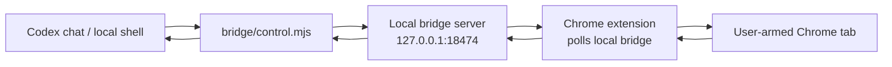

# Codex Chrome Bridge

Codex Chrome Bridge is a tiny local bridge that lets Codex control a real Chrome tab you have already authenticated.

The workflow is deliberately simple:

1. You install the Chrome extension.
2. You sign in to whatever website you need in Chrome.
3. You open the page you want Codex to use.
4. You click `Arm tab` in the extension popup.
5. Codex runs the local bridge and controls that armed tab.

That gives Codex a practical browser-control surface for real logged-in sites: coordinate clicks, text/selector clicks, typing, keypresses, scrolling, navigation, screenshots, and visible DOM inspection.

## Why This Exists

Many browser automation tools are great for fresh browser profiles, but awkward when the useful state is in your daily Chrome profile: Shopify Admin, dashboards, internal apps, course portals, vendor consoles, and other authenticated pages.

Codex Chrome Bridge keeps auth human-owned:

- You authenticate normally in Chrome.
- You explicitly arm one tab.
- Codex controls only that armed tab through a local bridge.
- You can stop/disarm at any time.

No API keys go inside the extension. No cloud service receives browser data. The bridge listens only on `127.0.0.1`.

## Architecture



The extension polls the local bridge for commands. That avoids exposing a remote socket from Chrome and keeps the control path simple and inspectable.

## Install

Clone the repo:

```bash
git clone https://github.com/makriman/codex-chrome-bridge.git
cd codex-chrome-bridge
```

Load the extension:

1. Open `chrome://extensions`.
2. Enable Developer mode.
3. Click `Load unpacked`.
4. Select the `extension` folder from this repo.

Start the bridge:

```bash
npm run bridge
```

Open the site in Chrome, authenticate however you normally do, then click the extension icon and choose `Arm tab`.

## Use With Codex

Tell Codex something like:

> Here is the repo: `makriman/codex-chrome-bridge`. Use it. I have installed the extension, signed in, and armed the tab.

Codex should read [SKILL.md](./SKILL.md), start the bridge if needed, check status, inspect the tab, and then use the command bridge.

## Command Examples

Check status:

```bash
node bridge/control.mjs status
```

Inspect visible interactive elements:

```bash
node bridge/control.mjs inspect 120
```

Click by coordinates:

```bash
node bridge/control.mjs click 420 315
```

Click by visible text:

```bash
node bridge/control.mjs click-text "Continue" --exact
```

Click by CSS selector:

```bash
node bridge/control.mjs click-selector "button[type='submit']"
```

Move the mouse:

```bash
node bridge/control.mjs move 600 400
```

Scroll:

```bash
node bridge/control.mjs scroll 900
```

Type into the focused field:

```bash
node bridge/control.mjs type "hello from Codex"
```

Press a key:

```bash
node bridge/control.mjs key Enter
node bridge/control.mjs key L Meta
```

Navigate the armed tab:

```bash
node bridge/control.mjs nav "https://example.com/dashboard"
```

Use browser history or reload:

```bash
node bridge/control.mjs back
node bridge/control.mjs forward
node bridge/control.mjs reload
```

Take a screenshot:

```bash
node bridge/control.mjs screenshot artifacts/current.png
```

Run a raw command:

```bash
node bridge/control.mjs raw '{"type":"click","x":400,"y":300}'
```

Stop/disarm:

```bash
node bridge/control.mjs stop
```

## Command Protocol

Commands are JSON objects queued by `POST /command` with the local token header:

```http
x-codex-bridge-token: <contents of .bridge-token>
```

Common command shapes:

```json
{ "type": "inspect", "limit": 120 }
{ "type": "click", "x": 420, "y": 315 }
{ "type": "click", "text": "Continue", "exact": true }
{ "type": "click", "selector": "button.primary", "index": 0 }
{ "type": "doubleClick", "x": 420, "y": 315 }
{ "type": "move", "x": 600, "y": 400 }
{ "type": "scroll", "deltaY": 900 }
{ "type": "type", "text": "hello" }
{ "type": "key", "key": "Enter" }
{ "type": "key", "key": "L", "modifiers": ["Meta"] }
{ "type": "navigate", "url": "https://example.com" }
{ "type": "back" }
{ "type": "forward" }
{ "type": "reload" }
{ "type": "screenshot" }
{ "type": "wait", "ms": 1000 }
{ "type": "stop" }
```

Results are fetched from `GET /result?id=<command-id>` with the same token.

## Safety Model

This project is intentionally powerful, so the trust boundary is explicit:

- The extension only acts after you arm a tab.
- Arming expires after 30 minutes.
- `Stop` in the popup disarms the tab and detaches Chrome Debugger.
- The bridge binds to `127.0.0.1`, not a public interface.
- The command API requires a per-clone local token in `.bridge-token`.
- Screenshots and inspect output stay local unless the agent includes them in chat.
- The extension controls the armed tab, not your whole browser profile.

Important: this tool does not replace Codex's own browser safety rules. If a command would submit a form, make a purchase, delete data, change account settings, or transmit sensitive data, Codex should still ask for the needed confirmation before doing it.

## What The Extension Can See

The content script returns visible interactive elements and their bounding boxes. It also works across iframes when Chrome permissions allow it.

For inspection, the content script avoids returning visible values from password, email, and telephone inputs. Screenshots can still show anything visible on the page, just like the user can see it.

## Development

No package install is required. The bridge uses Node's built-in HTTP server and `fetch`.

Run checks:

```bash
node --check extension/background.js
node --check extension/content.js
node --check extension/popup.js
node --check bridge/server.mjs
node --check bridge/control.mjs
```

Create a zip for manual distribution:

```bash
npm run zip
```

The zip is written to `dist/codex-chrome-bridge-extension.zip`.

## Project Layout

```text
extension/
  manifest.json
  background.js
  content.js
  popup.html
  popup.js
bridge/
  server.mjs
  control.mjs
SKILL.md
README.md
```

## Roadmap

- Optional native messaging bridge for lower-latency control.
- Richer accessibility tree output.
- Optional full-page screenshots.
- Higher-level helper commands for waits and target assertions.
- MCP wrapper around the same local command protocol.
