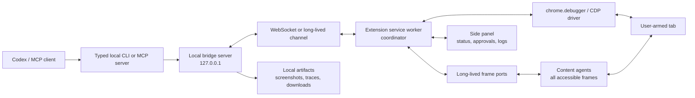

# Agent-Grade Roadmap

The north star is simple: Codex should get every practical browser ability a Chrome extension can safely expose, while the user keeps explicit control of the armed scope and final approval for sensitive actions.

## Product Principles

1. User-armed, never silent.
2. Local-first transport by default.
3. No password, cookie, or token export in normal operation.
4. Codex gets browser powers only inside the currently armed scope.
5. Final external actions are explicit: post, send, buy, delete, submit, change settings, or grant access.
6. Inspection is sanitized by default.
7. The command protocol should be typed, observable, and replayable.
8. Failures should be diagnosable without opening DevTools.
9. Prefer semantic actions over coordinates.
10. Prefer least privilege by default, with power-user permissions as explicit opt-in.

## Architecture V2

## Implemented Phase 0

- Token validation and repair for missing or empty `.bridge-token`.
- Token metadata with a non-secret fingerprint in `.bridge-token.meta.json`.
- Token-authenticated `status`, `doctor`, queue inspection, command enqueueing, and result reads.
- `bridgeInstanceId` for every bridge process.
- `armSessionId` for every user arm.
- Extension hello/reannounce behavior when it sees a new bridge instance.
- Explicit command statuses: `queued`, `leased`, `running`, `succeeded`, `failed`, `timed_out`, `cancelled`, `stale_arm`.
- Command leases, command heartbeats, command timeouts, cancellation, and flushing.
- CLI non-zero exit for failed, timed out, cancelled, or stale-arm commands.
- Sanitized inspection URLs by default.
- Sensitive field value redaction for password, email, phone, card, OTP, token, and secret-looking inputs.
- Visible element refs plus `click-ref` and `fill-ref`.
- `wait-for` helpers for text, selector, and URL.

## Implemented Milestone 1: Workflow Runtime

- `bridge/sdk.mjs` for generated workflow scripts.
- `bridge/run-workflow.mjs` for JavaScript and JSON workflows.
- Per-run directories under `artifacts/runs/`.
- `events.jsonl`, `command-log.jsonl`, `state.json`, and `summary.md` for each run.
- `artifacts/workflows/` convention for user-generated workflows.
- Step IDs and `--resume` support.
- `--dry-run` support.
- `--approve` support for runner-level approval gates.
- Screenshot and inspect snapshots on failed steps.
- JSON plan ops for inspect, screenshot, click, fill, type, key, scroll, navigate, wait/assert, approval, and raw commands.
- SDK helpers for status, inspect, screenshot, click refs/text/role/selector, fill refs, waits, assertions, and approval gates.

## Next Reliability Work

- Replace HTTP polling with WebSocket transport, keeping polling as fallback.
- Persist a bounded durable command log on disk for replay and diagnostics.
- Add an MCP server with typed tools over the same local protocol.
- Add extension-side command cancellation for commands already running.
- Add full-page screenshot and element crop commands.
- Add console error and recent network failure snapshots.
- Add frame tree and accessibility tree inspection.
- Add DOM/AX refs that survive common layout shifts better than content-script refs.
- Add active dialog and focused element reporting.
- Add download monitoring.
- Add side panel with command log, current arm, expiry countdown, screenshots, diagnostics, and stop button.
- Add final-action approval tokens for `send`, `purchase`, `delete`, `admin`, and other high-risk operations.

## Safety Modes

- `read`: inspect, screenshot, console, and network metadata.
- `draft`: type into forms and prepare messages or posts, without final submit.
- `confirm-write`: final submit only after user approval.
- `admin-confirm`: stronger confirmation for account, billing, security, permission, deletion, purchase, transfer, and irreversible actions.
- `blocked`: never allow credential export, cookie export, stealth tracking, access-control bypass, or bulk spam engagement.

## Sensitive Final Actions

The bridge should require an approval token before commands that:

- Post to social media.
- Send email, chat, DM, support replies, or public comments.
- Submit forms to external parties.
- Purchase, refund, cancel, transfer, trade, or change billing.
- Delete, archive, suspend, ban, invite, grant access, or rotate credentials.
- Change security, privacy, or account settings.
- Export customer, employee, financial, health, or private data.

## Capability Matrix

| Capability | Current | Target |
| --- | --- | --- |
| Authenticated browser access | User arms one tab | Same, with reconnect and stronger session policy |
| Transport | HTTP polling | WebSocket or long-lived channel, polling fallback |
| Command queue | Leases, status, cancel, flush | Durable queue with replay |
| Inspection | Visible interactives with refs | AX tree, DOM, frames, screenshot, console, network |
| Element targeting | Ref, text, selector, coordinate | DOM/AX refs, role/name, ref validation |
| Input | Fill ref, type focused, keypress | Select, check, drag, upload, clipboard |
| Screenshots | Visible viewport | Full-page, element crop, annotated screenshot |
| Downloads | None | Start, watch, rename, locate |
| Network | None | Observe requests, failures, response metadata |
| Safety | Conversation plus scoped arm | Protocol risk levels and approval tokens |
| UI | Popup | Side panel with logs, approvals, diagnostics |
| Codex UX | CLI | MCP tools plus CLI |
| Testing | Syntax checks | Unit, protocol, integration, extension E2E |

## Test Fixtures To Add

- `fixtures/basic-form.html`
- `fixtures/modal-shift.html`
- `fixtures/iframe-app.html`
- `fixtures/infinite-scroll.html`
- `fixtures/download.html`
- `fixtures/network-errors.html`
- `fixtures/contenteditable.html`
- `fixtures/shadow-dom.html`
- `fixtures/file-upload.html`
- `fixtures/social-compose.html`

## Maintainer Checklist

- A bridge restart does not require re-arming if the armed tab is still valid.
- Status cannot look healthy while command auth is broken.
- Two tabs cannot both claim to be the active armed target.
- Every command either succeeds, fails, times out, or is cancelled with an explicit status.
- Inspect output is safe to paste into Codex by default.
- Element refs survive common layout changes.
- Coordinates are a fallback, not the primary interface.
- Scroll, wait, screenshot, and inspect cannot wedge the queue.
- Final submit/post/send/purchase/delete commands require an approval token.
- The user can see and stop what Codex is doing from the popup or side panel.
